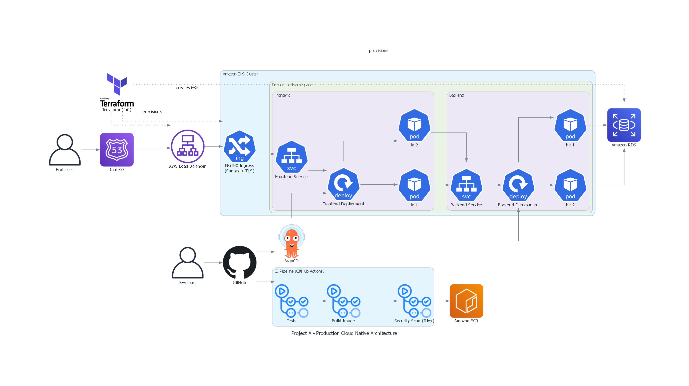

# Project A Kubernetes Ecosystem

## Overview

This organization hosts the **production-grade infrastructure and applications** for Project A. The ecosystem is built following modern **cloud-native and DevOps standards**, ensuring **security, scalability, observability, and automation** across all environments.

This central README provides a high-level view for recruiters, technical reviewers, or new team members and links directly to all the core repositories.

---

## Key Repositories

| Repository                   | Description                                                                                                                                                 | Link                                                                                         |
| ---------------------------- | ----------------------------------------------------------------------------------------------------------------------------------------------------------- | -------------------------------------------------------------------------------------------- |
| **Frontend-helm-chart**      | Production-ready frontend Helm chart with Deployment, Service, Ingress, HPA, sidecar metrics, ServiceMonitor, TLS via cert-manager, and ArgoCD Application. | [Frontend Helm Chart](https://github.com/Project-A-Kubernetes/Project__A_Helm_Chart_Frontend-.git) |
| **Backend-helm-chart**       | Backend microservices Helm chart with autoscaling, monitoring, and GitOps integration.                                                                      | [Backend Helm Chart](https://github.com/Project-A-Kubernetes/-Project_A_helm_chart_backend.git)   |
| **Terraform-infrastruture**          | Terraform modules for Kubernetes clusters, VPC, IAM roles, ECR, networking, database, VPN and managed AWS resources.                                                      | [Terraform Infrastructure](https://github.com/Project-A-Kubernetes/Project__A_Terraform__kubernetes_cluster.git)      |
| **Frontend-application**          | CI/CD workflows with GitHub Actions and ArgoCD for automated testing, builds, and deployments for my frontend application.                                                              | [CI/CD Pipelines](https://github.com/Project-A-Kubernetes/Project__A__frontend.git)                    |
| **Backend-application** | CI/CD workflows with GitHub Actions and ArgoCD for automated testing, builds, and deployments for my backend application.                                                           | [CI/CD pipelines](https://github.com/Project-A-Kubernetes/Project__A__backend-.git)     |
| **Observability-dashboards** | PrometheusRule, Application Monitoring, and Alerting rules for full-stack observability.                                                            | [Observability Dashboards](https://github.com/Project-A-Kubernetes/Project_A_Observability.git)     |
| **Cluster-Stacks** | prometheus Helm Chart installing, ingress-nginx-controller helm chart, metric-server, Cert-manager, other cluster tools.                                                            | [Cluster-Stack](https://github.com/Project-A-Kubernetes/Project_A_STACKS_TOOLS.git)     |

---

## Architecture Overview

This ecosystem follows a **production-grade, cloud-native architecture**:

* TLS termination with **cert-manager**
* Canary deployments and rolling updates via **Helm + NGINX Ingress**
* Horizontal Pod Autoscaling (HPA)
* GitOps deployment via **ArgoCD**
* Infrastructure provisioning via **Terraform**
* Monitoring and alerting with Prometheus/Grafana

---

## Standards & Best Practices

* **Security:** PodSecurityContext, IRSA, least privilege IAM, secrets never stored in ConfigMaps
* **Scalability:** HPA, resource requests/limits, canary deployments
* **Observability:** Metrics endpoints, ServiceMonitors, Grafana dashboards, alerting rules
* **CI/CD:** Automated pipelines with linting, tests, and GitOps deployment
* **Versioning:** Semantic Versioning + Git commit SHA for reproducibility
* **Environment separation:** staging vs production namespaces and values.yaml

---

## Getting Started

For a recruiter or new engineer exploring the ecosystem:

1. **Frontend Helm Chart** – Start with the app-level view.
2. **Terraform Infrastructure** – Review cluster setup and AWS architecture.
3. **CI/CD Pipelines** – Understand automated testing, builds, and deployment strategy.
4. **Observability Dashboards** – See monitoring and alerting setup for production workloads.

---

## Production Readiness Highlights

* **Infrastructure as Code (IaC)** for reproducible and versioned cluster provisioning
* **Automated CI/CD and GitOps workflows** for consistent deployments
* **Canary releases and rolling updates** for safe production rollout
* **Sidecar metrics** with Prometheus for observability
* **TLS and rate-limiting** for security and resilience
* **Resource requests/limits & HPA** for cost optimization and scaling

---

## Suggested Pins for GitHub Org Page

* frontend-helm-chart
* backend-helm-chart
* terraform-infra
* ci-cd-pipelines
* observability-dashboards

---

This centralized README serves as the **hub for the Project A Kubernetes ecosystem**, presenting the full production-grade DevOps and cloud architecture at a glance for recruiters or technical reviewers.
